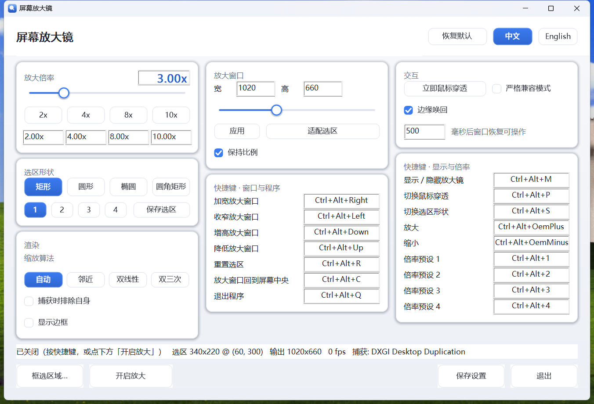
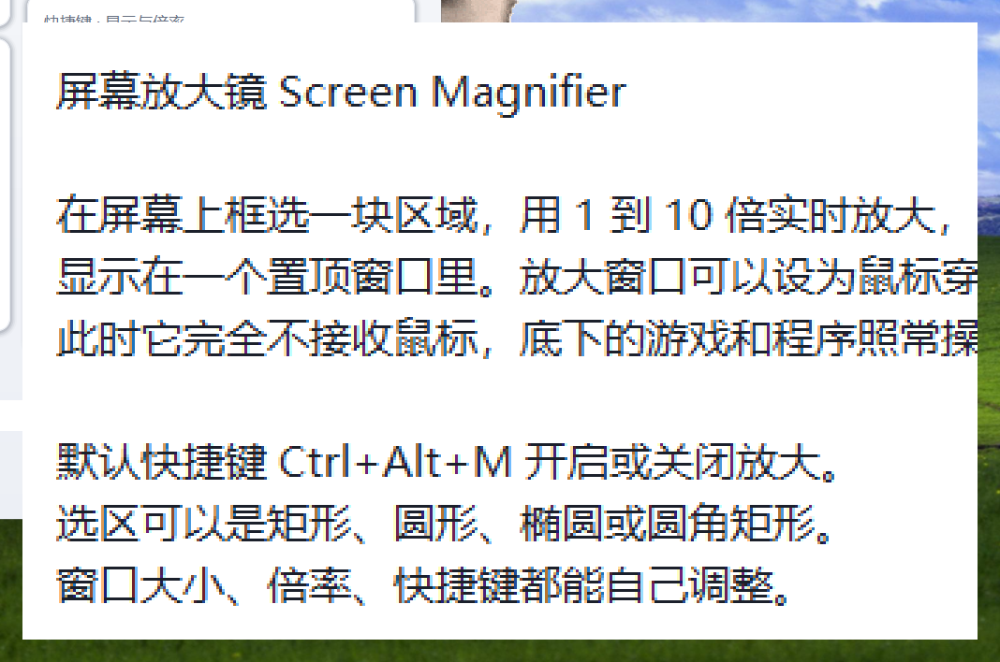

# 屏幕放大镜 · Screen Magnifier

A real-time screen magnifier for Windows 10/11: pick a region of the desktop in any of four
shapes, and watch it magnified up to **10×** in a topmost window that can be made completely
click-through so games and other applications keep receiving input.

Ships in **Chinese** with an in-app English switch. C++20, Win32, D3D11, DXGI Desktop Duplication for
capture and DirectComposition for presentation. No runtime, no installer, no registry: a single
executable.





*A 340×220 region at 3×. The magnified window is a real window — it can be dragged, resized from a
slider, and made to ignore the mouse entirely.*

---

## What it does

* **Magnify any region, 1× to 10×**, in one of four shapes — rectangle, circle, ellipse or rounded
  rectangle. Outside the shape the window is genuinely transparent, not painted over.
* **Click-through.** `Ctrl+Alt+P` makes the magnifier ignore the mouse completely, so clicks and
  drags reach the game underneath. Parking the cursor against its border for half a second brings it
  back, so the way out never depends on remembering a chord.
* **Everything is rebindable**, and a chord another application already owns is taken over rather
  than silently dropped. A chord *this* program already owns can be reassigned too: its own
  registrations are released while a chord field is waiting, so pressing `Ctrl+Alt+M` to give that
  chord to something else types it into the field instead of toggling the magnifier. **Mouse
  buttons count** — the right, middle and both side buttons can be bound, on their own or with
  modifiers.
* **Keep four regions.** Frame the minimap once, frame the status bar once, switch between them with
  a click instead of re-dragging.
* **Set the four preset factors** by typing them, and jump to them from the keyboard.
* **Live everything.** The zoom slider, the window-size slider and the region all apply as you drag;
  the status line reports the frame rate and which capture backend is in use.
* **Bilingual.** Chinese by default, English from the header toggle, applied everywhere at once.

---

## Quick start

```bash
./build.sh release        # builds build/magnifier.exe
./build/magnifier.exe
```

The app starts minimised to the notification area with a settings window open. Press
**Ctrl+Alt+M** to show the magnifier. It appears in the middle of the screen.

### Default hotkeys

All of them are rebindable in the settings window — click a chord field and press the new
combination (`Esc` cancels). A chord needs a modifier: bare keys would swallow that key in every
other program, so a bare letter is refused and the field says so, while the function keys are
allowed on their own because that is what people expect of them. A key the system takes before any
window sees it — `PrintScreen`, the media and volume keys — cannot be captured by the field and
will not appear there.

#### Mouse buttons

Click a field and press a mouse button. The right, middle and both side buttons can be bound, alone
or with `Ctrl`/`Alt`/`Shift`/`Win`; the left button cannot, because clicking the field with it is
what starts the capture. Two things are worth knowing:

* A bound mouse button is **taken over**, exactly as a keyboard chord is: it stops reaching the
  window under the cursor. Binding the middle button stops middle-drag everywhere. The system
  cannot register a mouse chord at all — `RegisterHotKey` accepts one and then never delivers it —
  so these bindings are served by the low-level mouse hook, which is also the only thing that can
  see a side button outside the window under the cursor. Strict compatibility mode turns that hook
  off, and the status line says so.
* The hook is installed **only while a mouse-button binding exists**. It costs every mouse event in
  the session a trip to the program's input thread, so it is not worth having for someone who
  binds keyboard chords alone.
* One way to *record* a chord does not work, and it is the system's doing rather than the field's:
  pressing `Win` opens the Start menu and takes the focus, so the capture ends before the rest of
  the chord arrives. `Ctrl`/`Alt`/`Shift` chords can all be recorded; a `Win` chord cannot. Every
  other key a window can receive works, and a chord can be given any of the four modifiers by hand
  in `config.json` if one is really wanted.

| Chord | Action |
|---|---|
| `Ctrl+Alt+M` | Show / hide the magnifier |
| `Ctrl+Alt+P` | Toggle mouse pass-through |
| `Ctrl+Alt+S` | Cycle selection shape (rectangle → circle → ellipse → rounded) |
| `Ctrl+Alt++` / `Ctrl+Alt+-` | Zoom through the ladder 1, 1.25, 1.5, 2, 2.5, 3, 4, 5, 6, 8, 10 |
| `Ctrl+Alt+1..4` | Jump to a preset factor (2×, 4×, 8×, 10× by default, editable) |
| `Ctrl+Alt+Arrows` | Resize the output window in 40 px steps, around its centre |
| `Ctrl+Alt+R` | Reset the selection to the centre of the desktop |
| `Ctrl+Alt+C` | Bring the output window back to the centre of the primary screen |
| `Ctrl+Alt+Q` | Quit |

#### When another application already owns a chord

`RegisterHotKey` fails if something else has the combination, and the chord would then silently do
nothing — which reads as "the program is broken" rather than "that key was taken". So a chord that
fails to register is handed to the low-level keyboard hook instead, and the status line says
`部分快捷键原被其他程序占用，已由本程序接管`. Only the chords that failed go into the hook: a chord
both paths handled would fire twice and the hook would swallow a key the shell had already
delivered. Taking the chord over does mean the other application stops seeing it — that is the point
of pressing it, and strict compatibility mode is the way to decline the whole arrangement.

**Strict compatibility mode** (`严格兼容模式` in the settings window) makes `RegisterHotKey` the only
input path: the hook is refused and used for nothing, so a chord another application owns stays
reported and inert. That is the design document's §3.3/§6.5 position, and it is the right one for
anyone who does not want a keyboard hook in their session.

### Using it

* **Pick a region** — `框选区域…` / `Pick region...` opens a full-desktop picker. Drag out a
  rectangle; drag *inside* it to move it, or its edges to resize it — the cursor says which. The
  bar across the bottom carries the instructions and a confirm and cancel button, so the mouse is
  always enough; `Enter` and `Esc` do the same thing from the keyboard, a double click inside the
  region confirms it, and arrows nudge by exactly one pixel (`Shift` for ten). `1`–`4` or `Tab`
  change the shape. A loupe shows the pixels under the cursor at 8×.

  The shipped default points at a 320×240 region in the middle of the screen.
* **Pass-through** — `Ctrl+Alt+P` makes the magnifier window ignore the mouse entirely, so clicks
  and drags reach whatever is underneath. To get it back, press `Ctrl+Alt+P` again, or park the
  cursor against the magnifier's border for half a second; the window outlines itself and becomes
  draggable again. Re-entering pass-through always takes the hotkey or the pinned button.
* **Resize the output window** — drag any edge, use `Ctrl+Alt+Arrows`, drag the size slider in the
  settings window, or type an exact size. Every one of them holds the window's centre, so it grows
  and shrinks in place instead of walking across the desktop; `Ctrl+Alt+C` puts it back in the
  middle if it has wandered. The minimum is 120×120 and the maximum is the current desktop.
  Resizing changes how much of the screen the window shows, never the magnification — for a bigger
  or smaller picture, use the factor.
* **Keep the ratio** — `保持比例` / *Keep aspect* locks the window's shape: change one axis by any
  route — a typed number, an arrow hotkey, the slider, an edge drag — and the other follows. Turn it
  off to resize the two axes independently.
* **Keep a region** — the numbered buttons under the shapes hold four regions. The lit button is the
  one that will be written to, and the status line says which slot each save went to
  (`已保存到选区 2`). Click one to recall it, adjust the region however you like, then
  `保存选区` / `Save region` writes the region now in force into the lit button. The first four
  buttons start out holding the shipped region, so recalling one always goes somewhere.
* **Change language** — the `中文` / `English` toggle in the settings header switches the whole
  interface and the tray menu immediately, and the choice is saved.
* **Set the presets** — the fields under the four factor buttons say what each preset is. The
  button jumps there, the chord `Ctrl+Alt+1..4` jumps there, and either can be changed by typing
  the number in the field. Anything from 1× to 10× is accepted, and a value out of range lands
  on the nearest one that is.
* **Start over** — `恢复默认` / `Restore defaults` in the header puts every setting back to its
  shipped value, including the kept regions and the presets, and re-centres both the region and
  the window.

---

## How it works

```
UI / control thread   windows, event pump, domain controllers (§2.3 allows merging these)
input thread          RegisterHotKey, cursor sampling for edge-dwell
capture thread(s)     one DXGI duplication session per monitor
render thread         D3D11 + DirectComposition
config worker         atomic writes
```

Modules cross those threads only with copyable value events on a bounded queue, or with the
single-slot "latest snapshot wins" mailbox that feeds the renderer. Nothing shares mutable state
without an owner.

```
src/core        pure domain: geometry, selection, magnification, state machine, config,
                and the string tables. Contains no Windows header at all.
src/platform    monitors and DPI, the input thread, the tray icon
src/capture     ICaptureBackend; DXGI Desktop Duplication primary, GDI BitBlt fallback
src/render      D3D11 pipeline and the DirectComposition presentation path
src/app         windows, composition root, entry point
tests/          core unit tests and the runtime acceptance harnesses
```

### The render pipeline

Each frame, for every monitor that intersects the visible part of the source region, the renderer
draws one quad that maps that monitor's share of the region onto the right place in the output
window, sampling that monitor's captured texture. Because adjacent tiles derive their shared edge
from the same integer source coordinate, a selection spanning two screens joins seamlessly with no
CPU-side stitching. A pixel shader then applies the shape mask and writes premultiplied alpha, which
DirectComposition blends over the desktop — so the area outside a circle or rounded rectangle is
genuinely transparent rather than painted over.

Textures are shared from the capture device to the render device as NT handles and synchronised with
a keyed mutex. The renderer never takes ownership of a texture the capture backend owns.

### The interface

There is no resource compiler in this toolchain, so the settings window builds itself in code and
paints its own chrome. The painting goes through **GDI+** rather than GDI's `RoundRect`: a flat fill
behind a one-pixel pen is a wireframe, and anti-aliased paths, linear gradients and soft shadows are
what make a surface read as rendered. Cards carry a real drop shadow, the primary button carries a
lit top edge, every control is rounded and none of them has a hard edge.

The slider, the segmented toggles and the checkboxes are drawn too — the stock trackbar cannot be
restyled beyond its channel colour, and a themed checkbox next to hand-drawn buttons looks like a
visitor from another program. The type face is chosen at runtime (`Microsoft YaHei UI` first, which
renders Chinese and Latin from one face, then `Segoe UI`), the window is laid out from DPI-scaled
metrics, and it sizes itself to its content once so it fits a scaled display without a scrollbar.

The application icon is **drawn at runtime** (`src/platform/app_icon.cpp`) rather than loaded,
because there is no resource compiler to embed one with. An `app.ico` beside the executable takes
precedence, so the icon can be replaced without a rebuild; `tests/make_icon.py` regenerates that file
at every size the shell asks for.

Two details keep it from flickering while the zoom slider is dragged. The window carries
`WS_CLIPCHILDREN`, so a repaint never refills the area beneath the fifty controls and then lets each
of them paint over it again; and `sync()` compares the incoming state against the last one it
pushed, so a slider tick only touches the read-out instead of rewriting every label and checkbox.

### Why the window is a viewport and not a stretched picture

The factor is the magnification, always. The window is a window onto the desktop: it shows
`window ÷ factor` worth of screen, centred on the region, and a resize changes how much is in view
and never how big it is. A 320×240 region at 4× is 320×240 pixels of source drawn 4× in whatever
window it is given — the whole region in a 1280×960 window, the middle quarter of it in a 640×480
one, and the region with 40 pixels of desktop around each edge in a 1440×1080 one.

The earlier model scaled the source to *fit* the window, which made the window size and the factor
two ways of saying the same thing. They then disagreed the moment the window was not exactly
`selection × factor` — including on the shipped defaults — and dragging an edge zoomed the picture
while the factor box went on showing the number it had before. Deriving the scale from the factor
instead means nothing the window does can contradict the read-out.

The shape is the window's own: it is the aperture the magnifier looks through, drawn inside whatever
rectangle the window has. A rectangle region fills the window and shows the desktop beside it; a
circle draws the largest circle the window can hold. Because the mask is the window rather than the
region, **shrinking the window shrinks the shape** — it does not crop into the shape's middle, which
is what a circle cannot survive (its middle is all circle, so the window filled edge to edge and the
shape disappeared). When the window's aspect differs from the shape's, the difference stays
transparent, as it always has.

`适配选区` / *Fit to source* sets the window to exactly the region at the current factor, which is
the size the factor asks for and the starting point for every zoom.

---

## Building

There is no usable MSVC on the machine this was developed on — the only install is Visual Studio
2010, which predates C++20, and it has no Windows SDK. The build therefore uses the clang and the
MinGW-w64 headers and import libraries bundled in the **`ziglang` Python package**:

```bash
python -m pip install ziglang
./build.sh package      # dist/ScreenMagnifier.exe -- the shippable artifact
./build.sh release      # build/magnifier.exe
./build.sh console      # same, but keeps a console attached for diagnostics
./build.sh test         # build and run the core unit tests
./build.sh debug        # -O0 with assertions
./build.sh clean
```

### Packaging

`./build.sh package` produces two things in `dist/`:

| Artifact | What it is |
|---|---|
| `ScreenMagnifier.exe` | the program on its own, 1.3 MB |
| `ScreenMagnifier-<version>.zip` | 0.5 MB: the executable plus `README.txt`, ready to send |

The executable carries its own icon and manifest, and every DLL it imports (`d3d11`, `dxgi`, `dcomp`,
`gdiplus`, `comctl32`, `kernel32`, the Universal CRT) ships with Windows 10/11 — there is no MinGW
runtime to copy alongside it, so it can be copied anywhere and run.

The archive holds a Chinese readme because the executable cannot explain itself: that Windows will
warn about a downloaded, unsigned program and how to get past it; the default hotkeys; where the
settings live; and how to remove the program. Those are exactly the things a recipient would
otherwise have to ask about. `tools/make_zip.py` builds it, writing the readme with a UTF-8 BOM so
the Chinese renders in whatever editor the recipient opens it with.

Resources are embedded *after* linking, by `tools/embed_resources.py`. There is no way to do it
during the link: the toolchain has no resource compiler, and its linker rejects a `.res` file
outright. So the script builds the resource directory — seven icon images, the group icon that ties
them together, and the manifest — and appends it as a `.rsrc` section, then points the optional
header at it. It writes to a temporary file and only replaces the original once everything has
succeeded, so a failure leaves a working executable that simply has no icon.

`tools/check_resources.py` verifies the result the way the shell sees it, loading the image as a data
file and asking for its resources and its Explorer icon rather than trusting what the embedder
thinks it wrote. The build runs it as part of `package`.

The embedded manifest is the one that matters at runtime: it declares **PerMonitorV2** DPI
awareness, the **comctl32 v6** dependency that turns on visual styles, and `asInvoker`, so the app
runs as an ordinary user and never prompts for elevation.

`zig cc` resolves `-l` flags against its own bundled `.def` files, so no import libraries need to be
installed. One exception: there is no `d3dcompiler` import library, so `D3DCompile` is resolved out
of `d3dcompiler_47.dll` at runtime — which is what the DirectX documentation recommends anyway, and
lets the app report a shader problem instead of failing to link.

Setting `MAG_DIAG=1` appends the internal frame counters to the status line.

---

## Testing

```bash
bash build.sh test              # 3476 assertions over the pure domain
python tests/verify_features.py # the shipped defaults: language, centring, 10x cap, the slider, reset
python tests/verify_picker.py   # the region picker: move, confirm button, double click, Enter
python tests/verify_runtime.py  # 22 black-box acceptance checks against the real executable
python tests/verify_visual.py   # proves the magnification is pixel-exact, in all four shapes
python tests/measure_perf.py    # the resource budgets, measured rather than assumed
python tests/verify_stress.py   # repeated show/hide cycles and a display-configuration change
python tests/profile_cpu.py     # attributes CPU use to the window, the capture and the renderer
python tests/make_icon.py       # regenerates app.ico at every size the shell asks for
python tools/check_resources.py # what the shell sees in a built executable
```

`tests/screenshot_ui.py` and `tests/screenshot_lang.py` capture the settings window so the layout and
the language switch can be eyeballed; they are development aids rather than pass/fail tests.

`verify_visual.py` puts a known pattern on screen at a known position, points the magnifier at
exactly that rectangle through its configuration file, and compares the window's pixels with the
source rectangle scaled by the configured factor. For the rectangle shape it reports a **mean
absolute difference of 0.00 per channel** — the output is pixel-identical to the source at 4×. For
the other three shapes it checks that the centre carries the pattern and that the corners are masked
away, which is what proves the mask is real transparency and not paint.

`tests/screenshot_ui.py` and `tests/screenshot_lang.py` capture the settings window so the layout
and the language switch can be eyeballed; they are development aids rather than pass/fail tests.

A note on how the acceptance tests drive input. On the development machine `SendInput` and
`keybd_event` do not trigger `RegisterHotKey` (a bare Python self-test that registers its own hotkey
and injects the matching chord receives nothing), so injecting keystrokes would have tested the
harness rather than the product. Instead the tests verify OS-level registration independently — by
registering the same chords from the test process and requiring
`ERROR_HOTKEY_ALREADY_REGISTERED` — and then drive everything downstream of `WM_HOTKEY` by posting
that exact message to the app's input thread.

### MEASURED, on the development machine

2560×1440 at 125 % scaling, single monitor, NVIDIA GPU.

| Metric | Budget | Measured |
|---|---|---|
| Idle working set | < 50 MB | 35.0 MB |
| Idle CPU | < 10 % of one core | 0.52 % |
| Running CPU, 4× magnifier | < 10 % of one core | 2.19 % |
| Present rate | — | 56 fps |
| GPU time per frame | — | 0.06 ms |
| Memory after switching off | — | 5.6 MB |
| Toggle latency | — | 0.17 s |
| Output window position and size | exact | exact (pixel-exact content match) |

The 50 MB figure refers to the idle state, which is what the requirement asks about; while actually
magnifying, the process holds about 60 MB because two D3D11 devices and a three-deep ring of
2560×1440 capture textures are alive. Switching the magnifier off releases the capture session and
the renderer's device, as the design's `Off` transition specifies.

---

## Design decisions worth knowing

**Coordinate space.** Everything internal is physical pixels in `int32`, and rectangles are
half-open `[left, right) × [top, bottom)`. The process is PerMonitorV2 aware. This matters more than
it sounds: a DPI-unaware process silently receives virtualised coordinates, and the first version of
the visual test failed for exactly that reason — the app was right and the *test* was wrong.

**Magnification is Q16.16 fixed point**, never a float, so 2× is exactly `2 * 65536` and repeated
adjustment cannot accumulate drift. The ceiling (`kFactorMax`) is the single source of truth: the
zoom ladder, the settings slider and the preset table all derive from it.

**Strings live in one table.** `core/i18n.h` declares every user-facing string once with its Chinese
and English forms side by side, and an X-macro generates both the enumeration and the lookup table
from that list — so a translation cannot be added to one and forgotten in the other, and no entry
can drift out of order.

**The session is released when the magnifier is off.** Holding a D3D11 device and a capture ring
while idle cost ~75 MB. Creating them on first use and dropping them on `Off` is what brings the
idle figure under budget — and it is what the design's state table already specified.

**The selection is masked in a shader, not on the CPU.** Circle, ellipse and rounded-rectangle
coverage is computed per pixel with integer-exact formulas mirrored on the C++ side, so the drawn
shape and the hit-test region can never disagree.

**Capture backends are chosen by probing.** DXGI duplication is refused for exclusive fullscreen,
protected video and some anti-cheat configurations, and it refuses at `start()` rather than at
construction. The app probes with a short-lived session, falls back to GDI BitBlt, and shows the
backend and the exact HRESULT in the status line rather than failing silently.

**Output windows are located by desktop rectangle, not by enumeration ordinal.** The topology
service numbers monitors in `EnumDisplayMonitors` order while DXGI numbers outputs per adapter;
those two schemes do not have to agree, and assuming they did was a real bug during development.

**The display's rotation is undone at sampling time.** Desktop Duplication hands back the surface in
the monitor's *native* orientation, so on a pivoted screen the captured texture's axes are swapped
relative to the desktop. The rotation travels with each frame and the renderer compensates when it
works out its texture coordinates. This is invisible on a landscape display and total on a portrait
one — every pixel comes from the wrong place — which is exactly the kind of defect that only a test
with a known pattern will catch.

---

## Known limitations

These are system boundaries, not configuration problems, and the app reports them rather than
pretending otherwise:

* Exclusive-fullscreen, protected-video and anti-cheat-blocked content may refuse desktop capture.
  The app then falls back to GDI capture and says so. It never injects into another process, never
  installs a driver, and runs with normal user rights.
* The output window cannot exceed the current desktop, so a large selection at a high factor is
  clamped — a 320×240 region at 10× needs 3200×2400 pixels.
* Cross-monitor selections are supported by the renderer, but the development machine has a single
  monitor, so that path has not been exercised against real hardware.
* Strict compatibility mode (settings window) drops the low-level keyboard fallback and keeps only
  `RegisterHotKey`. The fallback is otherwise used only for chords another application already owns,
  so a hotkey never silently does nothing.
* `PrintScreen`, the media keys and the volume keys are consumed by the system before any window
  receives them, so the rebind field cannot capture them. Everything the keyboard actually delivers
  to a window can be bound.
* A mouse button bound as a hotkey is taken over by the low-level mouse hook: the button no longer
  reaches the window under the cursor, and strict compatibility mode (which refuses that hook) makes
  the binding inert. The status line reports which of the two is happening.


## Configuration

`%APPDATA%\Magnifier\config.json`, written atomically on every change. Hand-editing it is fine; every
field is clamped into its documented range on load, and an unusable file is replaced with defaults
with a note in the status line. `language` is `"zh"` or `"en"`.

## Licence

MIT — see [LICENSE](LICENSE).
